<div align = 'center'>
    <font size="12">深度学习框架调研</font>
</div>
<div align = 'center'>

| 版本          | 1.0       |  
|---------------|-----------|
| 创建/修订时间 | 2023/5/15 |
|创建人         | 钱毅凡    |

</div>

# 调研背景
&emsp;&emsp;深度学习技术已经在许多行业和领域中得到广泛应用，例如计算机视觉、自然语言处理、语音识别和推荐系统等。以下是一些现实数据，这些数据展示了深度学习在一些应用领域中的重要性和影响： 
计算机视觉 
&emsp;&emsp;据Gartner预测，到2023年，计算机视觉技术将成为企业数字转型和自动化的重要组成部分。 
&emsp;&emsp;根据Statista的数据，2019年全球计算机视觉市场规模为240亿美元，并预计到2027年将达到780亿美元。 
自然语言处理 
&emsp;&emsp;根据MarketsandMarkets的报告，全球自然语言处理市场规模在2019年为105亿美元，到2024年预计将增长至269亿美元。 
&emsp;&emsp;据Gartner预测，到2022年，75%的企业将部署至少一项自然语言处理技术。  
语音识别
&emsp;&emsp;据MarketsandMarkets的报告，全球语音识别市场规模在2019年为685亿美元，预计到2025年将增长至2570亿美元。
根据Voicebot AI的数据，2020年，38%的美国成年人使用语音助手每天至少一次。
&emsp;&emsp;这些现实数据表明，深度学习在计算机视觉、自然语言处理和语音识别等领域中的应用越来越广泛，这也表明了对深度学习工具进行调研的重要性。对深度学习工具的深入了解将帮助AI开发工程师更好地开发和部署深度学习模型，以满足日益增长的市场需求。

# 深度学习基本原理

&emsp;&emsp;深度学习是一种人工智能技术，它可以让计算机从数据中自动学习并进行预测和决策。与传统机器学习技术不同的是，深度学习使用神经网络模型，这些模型模仿人类大脑的结构和功能，可以从数据中自动学习特征，并且能够处理大量复杂数据
&emsp;&emsp;拿生物的基本行为举例，神经网络类比于生物的大脑，输入类比于生物的听觉，视觉，触觉或者是以往的记忆，模型训练类比于生物对自然界中存在的东西的学习，训练后的模型参数类比于大脑中已经学习而得到的知识，模型推理或前向传播类比于生物中大脑对已经学习而识得的事物后，再对类似的事物的思考，输出是生物的行为或经过思考而得出的结论
&emsp;&emsp;深度学习的基本原理是通过神经网络模型对输入数据进行处理和变换，最终得到一个输出结果。神经网络模型由多个神经元组成，每个神经元接收来自前一层神经元的输入，并根据一些权重参数对输入进行计算和变换，最终输出到下一层神经元。通过这种方式，神经网络模型可以学习输入数据中的特征，进而对输入数据进行分类、预测等任务
&emsp;&emsp;通过不断地在神经网络中增加层数和神经元的数量，我们可以构建一个更加复杂和强大的模型，能够从输入数据中提取出更高级别、更抽象的特征，并对其进行分类、回归等任务
&emsp;&emsp;在深度学习中，模型的训练是通过反向传播算法实现的。它基于梯度下降优化方法，通过计算每个权重参数对损失函数的导数，来调整网络参数，使得模型在训练集上的预测结果尽可能地接近真实结果。最终，通过不断地迭代训练过程，模型的准确率和泛化能力可以不断提高

## Tensor数据结构
&emsp;&emsp;Tensor（张量）是PyTorch中的主要数据容器，可以用来表示输入数据、模型的权重和偏置、以及模型的输出等。
&emsp;&emsp;Tensor是一种多维数组或矩阵的数据结构，它是深度学习和机器学习中最基本的数据表示形式之一。
&emsp;&emsp;Tensor的操作可以包括元素级的操作（如加法、乘法等）、张量之间的广播（broadcasting）、重塑（reshaping）和切片（slicing）。这些操作使得Tensor成为一种强大而灵活的数据结构，适用于各种深度学习任务，包括图像处理、自然语言处理、语音识别和推荐系统等。
&emsp;&emsp;多个深度学习框架支持Tensor数据结构，例如PyTorch、TensorFlow、飞桨等，而Tensor数据结构在各个深度学习框架中的实现方式相互独立，并不互通，但是他们都支持将Tensor和numpy之间的相互转换

```python
import torch
import tensorflow as tf
import numpy

# PyTorch Tensor数据类型
pytorch_tensor = torch.tensor([1, 2, 3])

# 转化为Numpy数组类型
numpy_array = pytorch_tensor.numpy()

# 转化为TensorFlow数据类型
tensorflow_tensor = tf.convert_to_tensor(numpy_array)
```

## 卷积神经网络
&emsp;&emsp;卷积神经网络（Convolutional Neural Network，CNN）是一种受到生物视觉系统启发的人工神经网络，它在图像和视频处理领域取得了巨大成功。
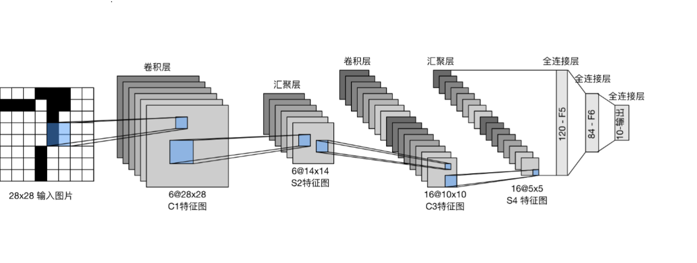
&emsp;&emsp;我们可以把卷积神经网络想象成一种特殊的神经网络，它专门设计用来处理图像。就像我们的大脑在看图像时，会注意到不同的特征，例如边缘、纹理或形状一样，卷积神经网络也会学习并关注图像中的各种特征。
总的来说，卷积神经网络是一种专门用于处理图像和视频数据的神经网络，通过卷积操作和特定的网络结构，可以有效地提取图像的特征，并在各种计算机视觉任务中表现出色

## 前向传播与反向传播
&emsp;&emsp;深度学习中的反向传播（Backpropagation）是一种用于训练神经网络的基本算法，它通过计算损失函数对网络中的权重和偏置进行调整，以使网络的输出尽可能接近期望的输出
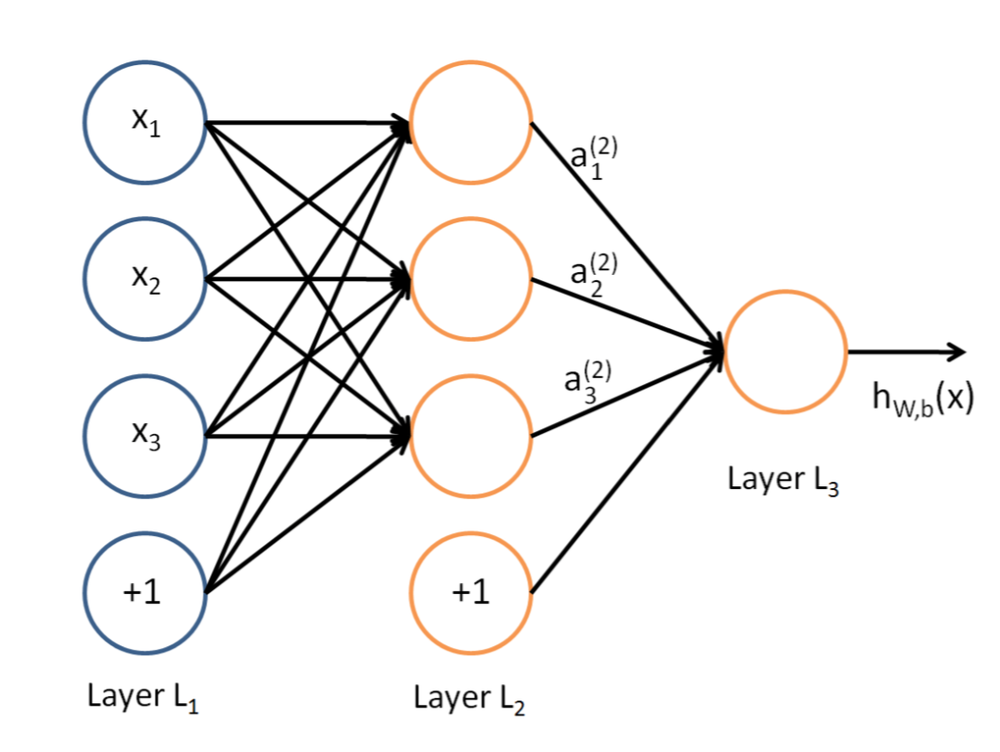
&emsp;&emsp;前向传播（Forward Propagation）：在前向传播阶段，输入数据通过神经网络进行正向计算，每一层的神经元将接收上一层的输出，并根据权重和偏置进行计算。每个神经元会对输入进行加权求和，并应用激活函数来产生输出。这样，从输入层开始，一直到输出层，网络逐层计算并传递数据  
&emsp;&emsp;反向传播（Backward Propagation)：在反向传播阶段，首先计算输出层的误差。将网络的实际输出与期望输出之间的差异，通过损失函数来度量，并反向传播给前一层。然后，根据权重和激活函数的导数，将误差逐层向后传播，计算每个神经元对误差的贡献。这样，误差从输出层反向传播到输入层，同时计算并累积每个权重和偏置的梯度 
通过计算梯度，反向传播使我们能够知道调整网络中每个权重和偏置的方向和程度。这些梯度可以使用梯度下降等优化算法来更新网络参数，使得损失函数逐渐减小，网络的输出逐渐接近期望的输出 
&emsp;&emsp;反向传播的关键思想是使用链式法则，根据输出对每个中间变量的影响，将误差从输出层向后传播。通过有效地计算梯度并更新网络参数，反向传播允许深度学习模型学习从输入到输出之间的复杂映射关系 
&emsp;&emsp;总结来说，反向传播是深度学习中一种用于训练神经网络的算法，通过计算损失函数对网络中的权重和偏置进行调整。它利用前向传播和链式法则的思想，将误差从输出层反向传播到输入层，以实现网络参数的优化和学习  

## 模型参数

&emsp;&emsp;在机器学习和深度学习中，模型网络中的参数是指模型内部可调整的变量，它们的值在训练过程中会被优化以使模型更好地拟合训练数据。描述的通俗一点，模型参数就相当于神经网络模型所学习到的技能，相当于大脑中对一种知识的记忆 
这些参数包括权重（weights）和偏置（biases） 
&emsp;&emsp;权重是模型网络中连接的强度，它们控制了输入特征与下一层神经元之间的信息传递。每个连接都有一个相关的权重，它们决定了输入特征对于模型输出的贡献程度。权重的值会在训练过程中通过反向传播算法进行调整，以最小化损失函数 
&emsp;&emsp;偏置是模型中的常量，它们被添加到每一层的输出上，以引入模型的灵活性和偏移。偏置允许模型对于不同的输入有不同的响应。与权重类似，偏置也是可调整的参数，会在训练过程中进行优化 
&emsp;&emsp;模型中的参数数量取决于模型的结构和层数。例如，在全连接神经网络中，每个神经元与上一层的所有神经元都有连接，每个连接都有一个权重参数，此外，每个神经元还有一个偏置参数。因此，全连接层的参数数量取决于输入和输出的维度以及层中神经元的数量 
&emsp;&emsp;模型网络中的参数起到了控制模型的能力和灵活性的作用。通过调整这些参数，模型可以逐渐学习到输入与输出之间的关系，并在训练数据上获得更好的性能  

## ONNX 开放的神经网络交换格式
PyTorch、TensorFlow、飞桨支持将模型保存为ONNX格式，方便为后续的优化 
&emsp;&emsp;ONNX（Open Neural Network Exchange）是一个开放的神经网络交换格式，旨在实现深度学习模型在不同深度学习框架之间的互操作性。它允许将模型从一个深度学习框架转移到另一个深度学习框架，而无需重新实现模型架构和逻辑。 
&emsp;&emsp;ONNX的设计理念是将模型表示为计算图（Computation Graph），其中节点表示各种操作（如卷积、池化、全连接等），边表示操作之间的数据流动。通过这种方式，ONNX可以捕捉模型的架构、权重和计算流程等重要信息，并使得模型在不同框架中的转换和执行更加容易。

```python
# PyTorch导出模型
torch.onnx.export(model, input_data, "model.onnx")

# TensorFlow导出模型
## 将模型转换为GraphDef
graph_def = model.as_graph_def()
## 冻结图中的变量
frozen_graph = convert_variables_to_constants_v2(sess, sess.graph.as_graph_def(), [])
## 将模型保存为ONNX格式
tf.io.write_graph(frozen_graph, ".", "model.onnx", as_text=False)

# 飞桨导出模型
## 创建飞桨静态图
paddle.enable_static()
paddle.static.save_inference_model("model", ['input'], [output], exe)
## 将模型保存为ONNX格式
static.convert.save_inference_model("model", ["input"], [output], exe, "model.onnx")
```

## ONNX 模型结构
ONNX模型结构描述了深度学习模型的网络结构和参数。 
ONNX模型结构主要包含以下几个关键部分： 

1. 图（Graph）：ONNX模型的核心是一个有向无环图（DAG），表示模型的计算图结构。图由一系列的节点（Node）和边（Edge）组成，节点表示计算操作，边表示数据流向。每个节点代表一个运算操作，如卷积、全连接、激活函数等。节点的输入和输出通过边连接起来，形成数据流的路径。
2. 节点（Node）：节点是ONNX模型图中的基本计算单元，代表一个特定的运算操作。每个节点包含以下几个重要属性：
    1. 输入（Inputs）：节点接收的输入数据，通常是其他节点的输出或模型的输入。
    2. 输出（Outputs）：节点产生的输出数据，作为其他节点的输入或者模型的输出。
    3. 运算（Op）：节点进行的具体计算操作，如卷积运算、池化运算、线性运算等。
    4. 参数（Attributes）：节点的运算参数，如卷积核大小、步幅、填充等。
3. 张量（Tensor）：在ONNX模型中，数据以张量的形式进行传递。张量是多维数组，可以是输入数据、模型的权重参数、中间计算结果等。张量的维度、数据类型和存储位置（如CPU或GPU）由ONNX模型定义和管理。
4. 模型输入和输出（Model Inputs/Outputs）：模型输入和输出是模型对外的接口，用于传递数据。模型输入指定了模型接受的输入数据的维度和数据类型，模型输出指定了模型产生的输出数据的维度和数据类型。
5. 模型参数（Model Parameters）：模型参数包括模型的权重和偏置等可训练参数。这些参数在模型训练过程中学习得到，并在模型推理时使用。模型参数在ONNX模型中以张量的形式存储和表示。  
ONNX模型结构的描述采用了Protobuf（Protocol Buffers）格式，这是一种轻量、高效的数据交换格式。通过使用Protobuf，ONNX模型可以跨不同深度学习框架进行转换和部署，方便模型在不同平台和环境中使用。

## 多机多卡训练模型
通过将训练任务划分为多个子任务，在多台机器的多个GPU卡上并行地进行计算，以加快训练速度和增加模型的容量。

多机多卡训练的基本原理如下：

1. 数据并行：
    在多机多卡训练中，我们通常采用数据并行的策略。数据并行是指将训练数据分成多个子批次，在每个GPU卡上分别加载一个子批次，并在每个卡上执行前向传播、反向传播和参数更新。通过并行处理多个子批次，可以加速训练过程。  
    前向推理并行：  
    是将输入一个 batch 的数据均分成多份，分别送到对应的 GPU 进行计算。与 Module 相关的所有数据也都会以浅复制的方式复制多份。每个 GPU 在单独的线程上将针对各自的输入数据独立并行地进行 forward 计算。  
    反向传播并行：  
    在主GPU上收集网络输出，并通过将网络输出与批次中每个元素的真实数据标签进行比较来计算损失函数值。接下来，损失值分散给各个GPU，每个GPU进行反向传播以计算梯度。最后，在主GPU上归约梯度、进行梯度下降，并更新主GPU上的模型参数。由于模型参数仅在主GPU上更新，而其他从属GPU此时并不是同步更新的，所以需要将更新后的模型参数复制到剩余的从属 GPU 中，以此来实现并行。

2. 模型并行：
    如果模型太大无法适应单个GPU卡的内存，我们可以采用模型并行的策略。模型并行是指将模型的不同部分分配到不同的GPU卡上，并在各个卡上并行计算。例如，可以将大型神经网络的不同层分配到不同的卡上，每个卡负责计算其分配的层的前向传播和反向传播。最后，通过收集和聚合各个卡上的梯度，实现参数的更新。

3. 参数同步：
    在多机多卡训练中，不同机器上的模型副本需要进行参数同步，以确保模型的一致性。常见的参数同步方法包括同步梯度平均（Synchronous Gradient Averaging）和参数服务器（Parameter Server）。同步梯度平均是指每个GPU卡计算完梯度后，将梯度发送到参数服务器进行平均，然后将平均梯度广播给各个卡。参数服务器是一台独立的机器，负责接收和更新模型的参数。

4. 进程间通信：
    多机多卡训练涉及到多台机器之间的通信和同步。通常使用消息传递接口（Message Passing Interface，MPI）或其他分布式训练框架提供的工具来实现进程间的通信。进程间通信用于协调各个节点上的训练进程，包括初始化、数据同步和模型更新。

多机多卡训练的实现需要根据具体的分布式训练框架和任务需求进行配置和调整。常见的分布式训练框架包括PyTorch的torch.distributed模块、TensorFlow的tf.distribute模块和PaddlePaddle的分布式训练模块等。  
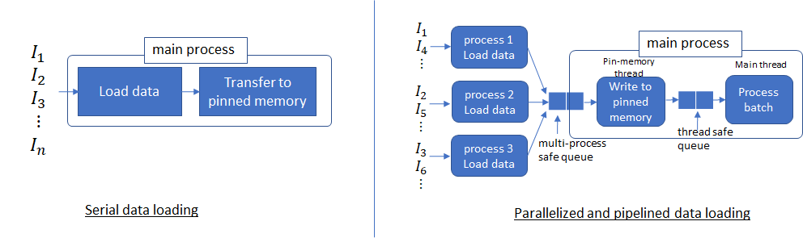  

# 现流行深度学习开发框架

## 框架简述

### PyTorch

#### 介绍
&emsp;&emsp;PyTorch是一个开源的机器学习库，主要用于构建深度学习模型。它由Facebook的人工智能研究团队于2016年开发，并于同年发布。PyTorch提供了一个灵活且易于使用的Python接口，使得构建神经网络和训练模型变得简单而直观。

&emsp;&emsp;PyTorch的一个显著特点是它的动态计算图。与其他深度学习框架如TensorFlow使用静态计算图不同，PyTorch允许用户在运行时构建、修改和调试计算图。这种动态计算图的特性使得模型的开发和调试过程更加灵活和直观，同时也提供了更好的可读性和可调试性。

&emsp;&emsp;PyTorch提供了丰富的工具和函数库，以支持各种深度学习任务。它包含了各种预定义的层、损失函数和优化算法，以及用于数据处理、模型评估和可视化的实用工具。此外，PyTorch还提供了灵活的扩展机制，使得用户可以自定义和扩展自己的模型和功能。

&emsp;&emsp;PyTorch广泛应用于学术界和工业界的深度学习研究和应用中。许多研究人员和工程师选择PyTorch作为他们的首选框架，因为它提供了高度灵活性、易用性和良好的性能。此外，PyTorch还有一个庞大的社区，提供了大量的教程、示例代码和支持，使得用户能够快速入门和解决问题。

#### 发展史
* 2002年：Torch框架的诞生：Torch是一个基于Lua编程语言的科学计算框架，提供了强大的矩阵计算和自动微分功能。它为深度学习研究人员和开发者提供了一个灵活的环境
* 2016年：PyTorch项目的开始：Facebook人工智能研究院（FAIR）团队开始了PyTorch项目的开发，旨在将Torch的灵活性和易用性引入Python生态系统
* 2017年：PyTorch开源发布：PyTorch在2017年正式开源发布，成为一个独立的深度学习框架。它融合了Torch的灵活性和Python的简洁性，迅速受到了学术界和工业界的关注
* 2018年：PyTorch 1.0版本发布：PyTorch 1.0版本引入了动态计算图（Dynamic Computational Graph）的概念，使得模型开发和调试更加直观和灵活。此外，1.0版本还增加了许多新功能和改进，如eager execution模式、TensorBoard支持等
* 2019年：PyTorch Hub和TorchServe发布：PyTorch Hub是一个模型仓库和分享平台，使得开发者可以轻松分享、发现和使用预训练模型。TorchServe是一个用于部署PyTorch模型的高性能模型服务器，使得模型的部署变得更加简单和高效
* 2020年：PyTorch Lightning项目的兴起：PyTorch Lightning是一个用于简化PyTorch训练循环的高级框架。它提供了一系列预定义的训练模式和功能，帮助开发者减少样板代码，提高代码的可读性和可维护性
* 2021年：PyTorch 1.9版本发布：PyTorch 1.9版本引入了许多新功能和改进，如混合精度训练、优化器的增强、图像分类工具包等。此外，1.9版本还提供了更多的模型解释性工具和可视化功能
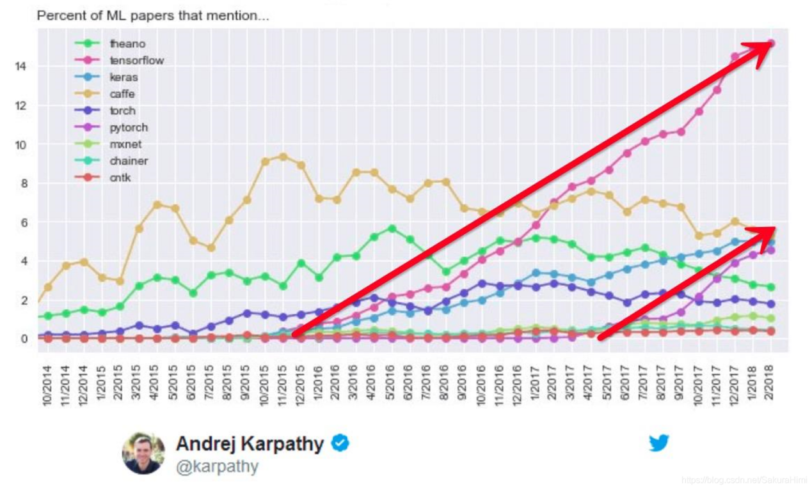
随着时间的推移，PyTorch在深度学习领域的影响力不断增加，成为了学术界和工业界中广泛使用的深度学习框架之一。它的发展历史充满了创新和改进，不断推动着深度学习技术的发展

#### 模块路径及其结构
1. torch
    >*这是PyTorch的根模块和根包。它包含了核心的张量操作和各种高级模块、函数和类，是使用PyTorch进行深度学习任务的基础。*
    1. torch.tensor
        >*这是是PyTorch中用于创建张量（tensor）的核心模块之一。张量是多维数组，类似于NumPy的ndarray对象，但可以在GPU上进行计算。torch.tensor模块提供了创建、操作和操作张量的函数和方法。*
    2. torch.autograd
        >*这是PyTorch中的自动求导（automatic differentiation）模块。自动求导是PyTorch的一个核心功能，它允许在神经网络训练过程中自动计算张量的导数。*
    3. torch.utils
        >*这是PyTorch中一个实用工具（utility）模块，提供了各种用于数据处理、模型训练和其他常见任务的实用函数和类。它包含了多个子模块，每个子模块都有自己的功能和作用。*
    4. torch.nn
        >*这是PyTorch中用于构建神经网络的核心模块之一。它包含了定义网络层、损失函数、优化器等的类和函数，为用户提供了搭建神经网络的基本组件*
    5. torch.optim
        >*这个模块提供了各种优化算法的实现，用于训练神经网络模型。它包含了常用的优化器类，例如SGD、Adam、RMSprop等，使用户能够选择合适的优化算法来优化模型参数。*
    6. torch.torchelastic
        >*这是PyTorch中的一个实验性模块，用于支持分布式训练和模型并行。它提供了用于管理分布式训练作业和资源的工具和函数，帮助用户更轻松地进行分布式训练和模型并行操作。*
    7. torch.cuda
        >*这个模块提供了与CUDA相关的功能和操作，用于在GPU上进行计算。它包含了管理GPU设备、张量在GPU和CPU之间的移动、并行计算等功能，使用户能够充分利用GPU加速深度学习任务。*
    8. torch.jit
        >*这个模块提供了用于模型脚本化和优化的工具和函数。它允许将训练好的PyTorch模型转化为可序列化的脚本或图形化表示，以便在不同环境中运行和部署模型。*
2. torchvision
    >*这是一个专门用于计算机视觉任务的PyTorch扩展包。它提供了许多用于处理图像和视觉数据的模块和函数，包括常用的数据集、预训练模型、图像变换、模型评估等。*
3. torchaudio
    >*这是PyTorch的音频处理库，用于加载、处理和转换音频数据。它提供了各种功能和工具，使用户能够进行音频数据的预处理、特征提取和模型训练等任务。*
4. torchtext
    >*这是一个用于文本处理和自然语言处理任务的PyTorch扩展包。它提供了文本数据的预处理、加载和转换功能，包括词向量表示、文本分类、语言建模等任务的模块和函数。*
5. torchsummary
   >*这是一个用于生成模型摘要（summary）的模块。它提供了一种简单的方式来查看和分析模型的结构，包括输入输出尺寸、参数数量等信息，有助于理解和调试模型。*

#### 官方文档
PyTorch官网页面介绍了正在支持并开发PyTorch社区，PyTorch所支持的功能与示例，PyTorch加速编译工具，PyTorch API文档  
下面列举出常用文档的网络地址  
[PyTorch 文档](https://pytorch.org/docs/stable/index.html)  
[TorchAudio API文档](https://pytorch.org/audio/stable/index.html)  
[TorchText API文档](https://pytorch.org/text/stable/index.html)  
[TorchVision API文档](https://pytorch.org/vision/stable/index.html)  

### 飞桨
#### 发展史
* 2016年：飞桨项目的启动：百度成立了飞桨项目，旨在提供一个开源的、易用的深度学习平台，以支持深度学习在各个领域的应用
* 2017年：飞桨开源发布：飞桨在2017年正式开源，并发布了第一个版本。作为一个全面的深度学习平台，它提供了丰富的工具和库，以及高性能的计算能力
* 2018年：飞桨与Paddle Fluid的合并：百度将其深度学习框架Paddle Fluid与飞桨项目合并，形成了统一的飞桨平台。这使得飞桨在深度学习领域更加完整和强大
* 2019年：飞桨开发者大会：首届飞桨开发者大会在北京举行，展示了飞桨在各个领域的应用案例和最新技术进展，吸引了大量开发者的关注
* 2020年：飞桨发布2.0版本：飞桨2.0版本引入了动态图模式，支持动态计算图和静态计算图两种模式。它还提供了更多的高级API和工具，进一步简化了深度学习任务的开发和部署
* 2021年：飞桨推出自研AI芯片：飞桨推出了自研的AI芯片——百度Kunlun芯片，旨在提供高性能的深度学习计算能力，加速深度学习模型的训练和推理

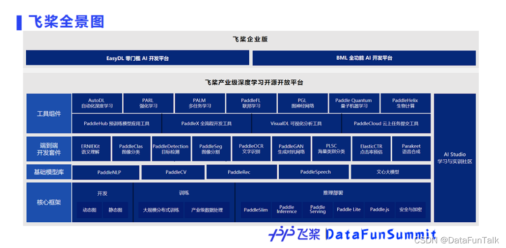

飞桨作为一个开源的深度学习平台，通过持续的创新和改进，在学术界和工业界中得到了广泛应用和认可。它提供了丰富的工具、库和算法，支持各种领域的深度学习应用，如计算机视觉、自然语言处理、语音识别等。飞桨的发展历史充满了技术突破和实践探索，为深度学习技术的推动做出了重要贡献

#### 官方文档
飞桨官网中文档解释全面，并加入大量实例和代码来补充说明，对初学者来说非常友好，并且官网是全中文，查找和阅读更加方便  
[API文档](https://www.paddlepaddle.org.cn/documentation/docs/zh/api/paddle/audio/Overview_cn.html)  

## PyTorch训练和服务化过程

### 安装部署
首先，对于Linux，Pytorch仅仅支持glibc>=v2.17的Linux发行版系统中（近十年内更新过的Linux发行版都满足该条件），并且需要Python3.6及其以上的版本，而对于Windows，Pytorch仅支持Pytorch3.8及其以上的版本。然后你需要安装PyTorch库。你可以从PyTorch官方网站（https://PyTorch.org）找到适合你操作系统和硬件配置的安装指南，并按照指南中的步骤进行安装  
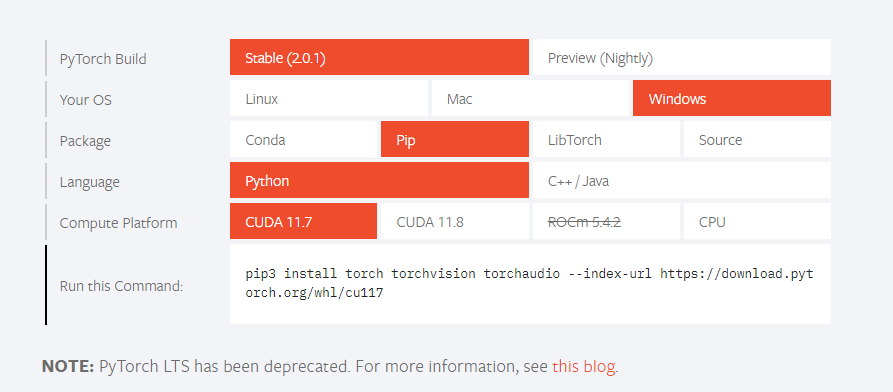  
&emsp;&emsp;第一栏：Stable稳定版和Preview预览版，Stable具有更好的稳定性，而Preview会加入更加新的功能，建议安装稳定(Stable)版本  
&emsp;&emsp;第二栏：操作系统版本，支持Linux，Mac和Windows，择需选择  
&emsp;&emsp;第三栏：Conda是Python包管理系统，用于安装多个版本的软件包及其依赖关系，并且可以随时切换，各种版本相互隔离，而Pip是Python自带的软件包管理系统，对于系统环境中的Python，在使用Pip时容易和之前安装的软件包发生版本冲突，建议使用Conda安装或者使用docker进行环境隔离  
&emsp;&emsp;LibTorch是C++/Java的库，里面包含了可以调用的头文件和二进制链接库  
&emsp;&emsp;Source是Pytorch的源码包，一般作为研究使用，或者自己对Pytorch中的函数 进行修改调优，若要使用该包，需要自己手动编译好源文件再去使用  
&emsp;&emsp;第四栏：Pytorch支持Python、C++和Java三种语言  
&emsp;&emsp;第五栏：CUDA是NVIDIA推出的通用并行计算架构，该架构使GPU能够解决复杂的计算问题，而ROCm是AMD推出的运算平台，硬件适配的情况下，在Linux中，两种模式都将支持，而Windows只支持NVIDIA显卡的CUDA运算模式，在没有NVIDIA和AMD显卡的情况下，选择CPU版本进行安装，在有上述两种显卡的情况下建议安装对应的GPU版本，GPU在处理大规模并行运算中，性能通常比CPU高出10倍到50倍不等，具体情况看计算机硬件中的CPU，GPU核数，频率，型号等等  
&emsp;&emsp;第六栏：对应的下载链接或下载指令  
对于Python把对应的环境搭建好就可以使用指令即可安装，而对于C++，使用CMake进行环境搭建或直接将环境放入系统编译环境中（不建议，卸载容易破坏编译环境，也有容易出现冲突），对于Java，可以使用C++API编写的Java包装器，但是现在更流行使用DJL Java深度学习框架  

以下为C++ 配置Libtorch中CMakefile.txt的样例
```cmake
cmake_minimum_required(VERSION 3.0 FATAL_ERROR)

# 项目名称
project(Main)

# Pytorch包目录
find_package(/usr/cpplib/libtorch/share/cmake/Torch/Torch REQUIRED)

# 输出项目名称，依赖main.cpp
add_executable(${PROJECT_NAME} Main.cpp)

target_link_libraries(${PROJECT_NAME} "${TORCH_LIBRARIES}")

set_property(TARGET ${PROJECT_NAME} PROPERTY CXX_STANDARD 14)
```

对于GitHub中源码编译，这里展示Linux的下载安装编译过程
```sh
# 下载依赖
conda install mkl mkl-include
# 仅限CUDA：如果需要，添加对GPU的LAPACK支持
conda install -c pytorch magma-cuda110  # 或者与你的cuda版本相匹配的
# （可选）如果使用torch.compile with inductor/triton，请安装匹配版本的triton
# 克隆后从pytorch目录运行
make triton

# 获取源码
git clone --recursive https://github.com/pytorch/pytorch
cd pytorch
# 若下载已完成但是子模块下载出错
git submodule sync
git submodule update --init --recursive

# 安装
export CMAKE_PREFIX_PATH=${CONDA_PREFIX:-"$(dirname $(which conda))/../"}
python setup.py develop
```
Github中通过选择Tag来选择要编译的版本，目前为2.0.0版本，与通过官网首页下载方式所下载的版本一致  
PyTorch查看版本
```python
import torch
print(torch.__version__)
```
### 数据准备和预处理
&emsp;&emsp;为了将原始数据转换为适合机器学习模型训练的格式，并进行必要的数据增强和规范化。  
&emsp;&emsp;在采集数据环节，许多领域都存在公开可用的数据集，你可以通过搜索相关领域的数据集库或开放数据平台来获取  
| 网站 | 数据类型 | 网址 |
|---|---|---|
|ImageNet|图像数据集|https://image-net.org/|
|COCO|图像数据集|https://cocodataset.org/|
|MNIST|图像数据集|http://yann.lecun.com/exdb/mnist/|
|Free Music Archive (FMA)|音频数据集|https://freemusicarchive.org/|
|LibriSpeech|音频数据集|http://www.openslr.org/|
|UrbanSound8K|音频数据集|https://urbansounddataset.weebly.com/urbansound8k.html|
|Common Craw|文本数据集|https://commoncrawl.org/the-data/get-started/|
|Reddit社交平台 评论区数据|文本数据集|https://www.reddit.com/r/datasets/comments/3bxlg7/i_have_every_publicly_available_reddit_comment/|

&emsp;&emsp;我们也可以使用爬虫工具在互联网上的图形或音频数据，但是要注意数据的版权与互联网用户的隐私，应该获取公开的，或者已经获得许可的数据作为数据来源  

在选择数据进行训练时，应该考虑如下因素：
1. 数据质量：确保你的数据集是准确、完整且无偏的。低质量的数据可能导致模型学习到错误的模式或产生不可靠的预测结果
2. 数据多样性：确保你的数据集具有多样性，涵盖了各种可能的输入情况。这可以帮助模型更好地泛化并适应未知的数据
3. 数据量：尽可能收集更多的数据。更大的数据集通常可以提供更好的泛化性能，帮助模型更好地捕捉数据中的模式
4. 标签质量：如果你的任务需要标签，确保标签是准确和可靠的。标签错误可能会严重影响模型的训练和性能
5. 数据均衡：对于分类问题，确保各个类别的样本数量大致均衡。不平衡的数据集可能导致模型对少数类别的学习效果较差
6. 数据预处理：根据你的任务和模型的需求，对数据进行适当的预处理。这可能包括数据清洗、归一化、标准化或其他转换操作
7. 数据划分：将数据集划分为训练集、验证集和测试集。训练集用于模型的训练，验证集用于调整超参数和监控模型的性能，测试集用于最终评估模型的泛化能力

数据加载：  
&emsp;&emsp;数据加载是将训练数据有效地加载到模型中进行训练  
&emsp;&emsp;首先，需要准备好训练数据集。PyTorch提供了torch.utils.data.Dataset类和torch.utils.data.DataLoader类，可以帮助你加载和批量处理数据。也可以自定义一个Dataset类来加载数据，并使用DataLoader类将数据划分成小批量进行训练
```python
class MyData(Dataset):
    def __init__(self, root_dir, label_dir):
        self.root_dir = root_dir
        self.label_dir = label_dir
        self.path = os.path.join(self.root_dir, self.label_dir)
        self.img_path = os.listdir(self.path)
    def __getitem__(self, idx):
        img_name = self.img_path[idx]
        img_item_path = os.path.join(self.root_dir, self.label_dir, img_name)
        img = Image.open(img_item_path)
        label = self.label_dir
        return img, label
    def __len__(self):
        return len(self.img_path)
```
&emsp;&emsp;Dataset只定义了从哪里读取数据，读取数据的方式，和数据的多少  
&emsp;&emsp;DataLoader根据Dataset中的定义，将数据从磁盘加载到内存中来，同时也添了数据打乱与排序，并行加载，数据类型转换和数据的迭代循环读取的功能    
在数据加载后，你可以对数据进行预处理。这包括对文本、音频或图像数据进行各种操作  

对于图像数据，PyTorch提供了各种函数和工具，如torchvision.transforms模块用于图像数据的常见预处理操作，可以进行标准化、归一化、裁剪、缩放、转换格式
|操作|方法|作用|
|---|---|---|
|缩放|torchvision.transforms.Resize|将图像大小调整为指定尺寸|
|裁剪|torchvision.transforms.CenterCrop|对图像进行中心裁剪|
|标准化|torchvision.transforms.Normalize|对图像数据进行标准化处理|
|随机变换|torchvision.transforms.RandomRotation|进行随机变换来增加数据多样性|
|滤波器|torchvision.transforms.Filter|应用各种图像滤波器，如边缘检测、模糊等|

对于音频数据，torchaudio.transforms模块用于音频数据的预处理，下列列举出常用的函数  

|操作|方法|作用|
|---|---|---|
|重采样|torchaudio.transforms.Resample|将音频数据重采样到指定的采样率|
|归一化|torchaudio.transforms.Normalize|对音频数据进行归一化处理|
|去除静音部分|torchaudio.transforms.Vad|根据音频数据的能量来去除静音部分|
|短时傅里叶变换（STFT）|torchaudio.transforms.Spectrogram|可以将音频数据转换为时频图|
|滤波器|torchaudio.transforms.LowpassFilter/HighpassFilter|可以应用低通滤波器或高通滤波器|

对于文本数据，下面展示torchtext常用的方法
|操作|方法|作用|
|---|---|---|
|单词级别的转换|torchtext.vocab.Vocab.stoi|使用词汇表将文本数据中的单词转换为对应的索引|
|字符级别的转换|torchtext.vocab.CharVocab|构建字符级别的词汇表|
|使用预训练的词向量|torchtext.vocab.Vectors.stoi|将单词转换为对应的向量|

预处理示例过程
1. 对于图像
```python
import torch
import torchvision
from PIL import Image
# 加载图像
img = Image.open("png_file.png")
# 图像大小规范化
torchvision.transform.Resize((100, 100))(img)
# 将PIL图像转化为Tensor对象
torchvision.transform.ToTensor()(img)
```
2. 对于音频
```python
import torch
import torchaudio
# 读取音频数据
waveform, sample_rate = torchaudio.load('audio_file.wav')
# 标准化
normalized_waveform = torchaudio.transforms.Normalize()(waveform)
# 将数据转化为Tensor对象
waveform_tensor = torch.tensor(waveform)
```
3. 对于文本
```python
import torch
from torchtext import data
# 定义一个Field对象来指定文本数据的预处理方式
TEXT = torchtext.data.Field(sequential=True, lower=True, tokenize='spacy')
# 加载你的文本数据集并创建一个TabularDataset对象
fields = [('text', TEXT)]
dataset = data.TabularDataset('data.csv', 'csv', fields)
# 构建词汇表（Vocabulary）并使用该词汇表将文本数据转换为数字序列
TEXT.build_vocab(dataset)
# 使用vocab.stoi属性将文本转换为张量（tensor）数据类型，这将返回一个整数序列，其中每个单词都用其在词汇表中的索引表示
text_tensor = torch.tensor([TEXT.vocab.stoi[word] for word in text.split()])
```

预处理后，无论是图像，音频还是文本，都会转变成Tensor对象
1. 图像：[抓取数，通道数，高，宽]，其中抓取数是对一批数据的抓取量，将多个图像数据组作为一个维度，通道数通常为图像颜色通道，灰度图为1，彩色图为3，带有透明量的彩色图为4，图像Tensor中一个元素所对应的值为该颜色通道上的该像素点所对应的颜色深度
2. 音频：[抓取数，左右声道，采样点]，其中左右通道为立体声所设立，可能不存在该维度，音频Tensor中一个元素所对应的值为该声道采样点上的振幅
3. 文本：[抓取数，单词数/字符数]，每个文本Tensor被表示为一系列整数，每个整数对应于词汇表中的一个单词或字符

官方页面的下载并没有给出torchtext的下载方式，torchtext需要额外下载安装，在Pip包中使用pip install torchtext=<版本号> 进行安装，安装需要与当前PyTorch版本相匹配，匹配图片如下图，若使用conda进行安装，使用conda install -c pytorch torchtext。

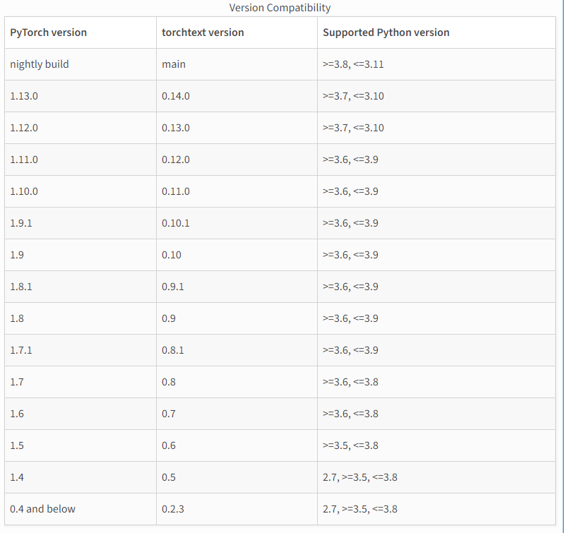

### 模型的构建与训练
1. 定义模型结构  
定义模型结构的目的是确定模型的基本组成和参数，即确定模型中的层、连接方式和参数数量。模型结构定义了模型的拓扑结构，决定了信息在模型中的流动方式。  
使用PyTorch提供的模型构建模块（如torch.nn）来定义模型的结构。可以通过继承torch.nn.Module类并实现forward方法来定义自定义模型。在forward方法中，描述模型的前向传播过程，即输入数据通过网络层的计算过程。重要的是，需要明确你的任务是什么，例如图像分类、目标检测、回归等。对于不同的任务，可能需要选择不同的损失函数和优化算法。同时，了解你正在构建的模型类型，例如卷积神经网络（CNN）、循环神经网络（RNN）等，也会指导你在选择损失函数和优化算法时的考虑。

|名称|结构|优点|应用场景|
|---|---|---|---|
|前馈神经网络Feedforward Neural Networks|由多个全连接层组成的模型，信号从输入层经过一系列隐藏层传递到输出层|简单易懂，易于实现和训练，适用于各种分类和回归任务|图像分类、文本分类、回归分析等|
|卷积神经网络Convolutional Neural Networks|包含卷积层、池化层和全连接层，能够有效处理具有网格结构的数据（如图像）|参数共享、局部感知野和平移不变性使其在图像和视频处理任务中表现出色|图像分类、目标检测、图像分割等|
|循环神经网络Recurrent Neural Networks|通过循环连接的隐藏层，能够处理序列数据，具有记忆能力|对于处理序列数据（如文本、语音）具有良好的表现，能够捕捉时间相关性|语言模型、机器翻译、语音识别、情感分析等|
|长短时记忆网络Long Short-Term Memory Networks|一种循环神经网络的变体，通过门控单元来有效地捕捉和记住长期依赖关系|对于处理长期依赖关系的序列数据表现较好，解决了传统循环神经网络的梯度消失问题|机器翻译、文本生成、语音识别等|
|支持向量机Support Vector Machines|非神经网络模型，通过在高维特征空间中找到最优超平面来进行分类|对于高维数据具有较好的泛化能力，适用于小样本、非线性可分的分类问题|图像分类、文本分类、异常检测等|
|生成对抗网络Generative Adversarial Networks|由生成器和判别器组成的对抗模型，通过博弈训练生成器生成逼真的数据|能够生成逼真的新样本，用于图像生成、图像修复、数据增强等|图像生成、图像增强、图像超分辨率等|

2. 定义损失函数  
选择合适的损失函数来衡量模型的预测输出与真实标签之间的差异，得出的结果可以用于前向传播，并通过优化器更新模型参数。  
PyTorch提供了许多常见的损失函数，如均方误差（MSE）、交叉熵损失  （CrossEntropyLoss）等。根据任务的特点和需求，选择适当的损失函数。其中均方误差通常用于回归问题，其中目标是预测连续值的问题。例如，房价预测、连续型变量的预测等。而交叉熵损失通常用于分类问题，其中目标是预测样本所属的类别。例如，图像分类、文本分类等  

3. 定义优化器  
&emsp;&emsp;选择合适的优化器来更新模型的参数，以最小化损失函数。  
&emsp;&emsp;常用的优化器包括随机梯度下降（SGD）、Adam、RMSprop等。可以使用PyTorch提供的优化器模块（如torch.optim）来实例化优化器对象，并设置学习率和其他超参数  
其中SGD在每个训练样本上计算梯度并更新参数，因此计算速度相对较快。然而，SGD可能受到噪声梯度的影响，导致收敛过程不稳定，需要适当调整学习率  
Adam结合了动量（Momentum）和自适应学习率的优点。它利用梯度的一阶和二阶矩估计来调整学习率，并且具有较好的收敛性和泛化性能。Adam适用于大多数情况下的优化需求  
RMSprop通过维护梯度平方的移动平均来自适应地调整学习率。它在处理具有不同梯度大小的特征时表现良好，可以更好地适应非平稳的数据分布  

4. 迭代训练  
通过迭代训练数据集来更新模型的参数。通常，每个迭代步骤包括以下操作：
    1. 将输入数据和对应的标签加载到设备（如GPU）上
	2. 将输入数据传递给模型进行前向传播，得到模型的预测输出
	3. 根据预测输出和真实标签计算损失函数
	4. 通过调用优化器的zero_grad方法清除之前的梯度信息
	5. 调用backward方法计算梯度
	6. 调用优化器的step方法更新模型参数
下列是训练步骤的代码样例
```python
epoch = 10
for i in range(10, 20):
    print("Train step:[{}]".format(i + 1))
    for data in train_data_loader:
        imgs, targets = data
        outputs = xmodel(imgs)
        loss = loss_fn(outputs, targets)

        optimizer.zero_grad()
        loss.backward()
        optimizer.step()
        
        total_train_step = total_train_step + 1
```

5. 迭代训练评估  
&emsp;&emsp;在训练过程中，可以定期评估模型在验证集上的性能。可以使用相同的前向传播过程和损失函数来计算验证集上的损失和准确率等指标。根据需要，可以选择保存最佳模型参数  
&emsp;&emsp;另外TensorBoard 是一个用于可视化和监控模型训练过程的工具，可以使用 TensorBoard 记录和可视化训练过程中的标量指标，如损失函数、准确率、学习率等。  
&emsp;&emsp;通过使用 SummaryWriter 对象，你可以在训练循环中将这些标量指标写入 TensorBoard 日志文件，并在 TensorBoard 中查看和比较它们的变化趋势，通过结合 PyTorch 和 TensorBoardX，你可以方便地使用 &emsp;&emsp;TensorBoard 的功能来监控和分析模型的训练过程、可视化数据和探索模型的结构。这为你提供了一个强大的工具来加速模型开发、调试和优化的过程  


6. 训练结束和保存模型  
&emsp;&emsp;过指定的训练迭代次数或达到某个停止条件，确定训练结束。最后，可以使用torch.save保存模型的参数，以便在后续的服务化阶段使用  
&emsp;&emsp;在保存时，一般约定pt后缀名表示用于保存整个模型的权重和状态字典，包括模型的结构、参数和其他相关信息。通过将模型保存为".pt"文件，可以在加载模型时完全恢复模型的状态  
&emsp;&emsp;而pth后缀名也是用于保存模型权重和状态字典的文件扩展名。它通常用于表示只保存模型的权重和状态字典，而不包括模型的结构和其他信息。这种情况下，加载模型时需要先创建相应的模型结构，然后将权重和状态字典加载到模型中  
下面列举一些保存方法

|保存方式|方法|
|---|---|
|保存整个模型的信息|```torch.save(model, "model.pt") ```|
|保存模型的权重和状态字典|```torch.save(model.state_dict(), "model_state.pth")```|
|保存优化器状态|```torch.save(optimizer.state_dict(), "optimizer_state_dict.pth")```|

可以将模型的状态字典和优化器的状态字典一起保存为checkpoint，以便在训练过程中进行断点续训或用于后续的推断   
```python
checkpoint = {
    'model_state_dict': model.state_dict(),
    'optimizer_state_dict': optimizer.state_dict(),
    'epoch': epoch
}
torch.save(checkpoint, 'checkpoint.pth')
```
&emsp;&emsp;断点续训是一种是指在模型训练过程中，将当前训练的状态保存下来，以便在之后的时间点恢复训练并继续训练的过程。断点续训对于大规模深度学习模型的训练非常有用，特别是在长时间训练或计算资源有限的情况下  
&emsp;&emsp;通常，断点续训包括保存模型的权重和状态字典、保存优化器的状态字典以及保存当前训练的其他相关信息，例如当前的训练轮数、学习率等。通过保存这些信息，可以在中断训练后重新加载模型和优化器状态，从保存的时间点继续进行训练，而无需从头开始  
&emsp;&emsp;仅保存模型的权重与状态字典的文件已经足够去部署到服务中，并且这种方式保存的文件所需要的空间更小  
### 模型评估
&emsp;&emsp;在训练完成后，需要准备用于评估模型的数据集，如先前划分的验证集，通过导入测试集数据，通过模型输出，对准确率进行测试  
&emsp;&emsp;在使用验证集进行评估的时候，可以在使用验证集进行模型推理之前使用torch.no_grad方法，torch.no_grad 是一个上下文管理器，在其管理范围内 PyTorch 不再计算模型各参数的梯度，即使参数的 requires_grad 属性为 True，这能有效减少模型计算时所需的内存/显存（因为保存参数梯度需要大量的内存/显存）。这在模型的 evaluation 和 test 以及 predict 这些非训练阶段中很有用  
若模型评估结果不符合预期，应该根据实际情况重新调整，并重新训练  
1. 学习率过高或过低  
学习率是控制参数更新的步长，如果学习率设置过高，会导致参数在优化过程中发生震荡或发散；如果学习率设置过低，会导致优化过程非常缓慢。可以尝试调整学习率的大小，并观察训练结果的变化  
2. 数据预处理问题  
数据预处理对模型的训练效果有重要影响。确保数据预处理的步骤正确，例如数据归一化、标准化、平衡等。特别是对于图像数据，常见的预处理操作包括图像缩放、裁剪、旋转、翻转等  
3. 网络结构不合适  
模型的结构可能过于简单或过于复杂，无法很好地拟合数据。可以尝试调整网络的层数、神经元的数量等，或者尝试不同的模型结构，如更深的网络或更宽的网络  
4. 过拟合  
过拟合是指模型在训练集上表现很好，但在测试集上表现较差。可能是由于模型过于复杂，导致过拟合。可以尝试使用正则化技术，如L1或L2正则化、Dropout等来减少过拟合的风险  
5. 数据集不足或不平衡  
数据集的规模较小或样本不平衡可能导致模型训练困难。可以尝试增加训练数据的数量，或者使用数据增强技术来扩充数据集  
6. 初始化问题  
模型参数的初始化也可能影响训练结果。尝试使用不同的初始化方法，如随机初始化、预训练模型的迁移学习等  
7. 训练时长不足  
训练模型需要足够的时间和迭代次数，特别是在复杂任务和大规模数据集上。确保给模型足够的训练时间，同时观察训练过程中的损失曲线和性能指标的变化  

以下为通过验证集测试所训练模型的准确率
```python
with torch.no_grad():
    for data in test_data_loader:
        imgs, targets = data
        outputs = xmodel(imgs)
        loss = loss_fn(outputs, targets)
        total_test_loss += loss.item()
        accuracy = (outputs.argmax(1) == target).sum()
        total_accuracy += accuracy
```

### 模型优化 
&emsp;&emsp;通过模型优化，可以使模型在给定任务和数据上表现得更好，提高模型的预测准确性、泛化能力和效率。模型优化是机器学习和深度学习中的关键步骤，对于构建高性能和可靠的模型具有重要意义。  

1. 量化（Quantization）  
量化是将浮点模型参数和操作转换为较低精度（如8位整数）的过程。这可以显著减小模型的大小，加快推理速度，并降低内存和能耗需求，同时保持相对较高的精度。各个深度学习框架都提供了量化工具和API，可以根据具体框架的文档进行相应操作。
2. 剪枝（Pruning）  
剪枝是指去除模型中不必要的连接或参数，以减少模型的大小	和计算复杂度。这可以通过标识和删除冗余的权重、神经元或连接来实现。剪枝技术可以减小模型的体积，并提高推理速度。深度学习框架通常提供了剪枝工具和库，可以用于剪枝操作。
3. 模型压缩（Model Compression）  
模型压缩是一种综合技术，包括量化、剪枝、权重共享和矩阵分解等方法。通过组合多种技术，可以进一步减小模型的大小，并提高推理速度。模型压缩技术通常需要自定义实现，但也可以利用深度学习框架提供的工具和库来辅助实现。
4. 硬件加速器优化  
某些深度学习框架支持与硬件加速器（如GPU、TPU等）集成，以加速模型的推理和训练。通过将模型映射到硬件加速器上，并利用加速器提供的并行计算能力，可以显著提高模型的速度和效率。
5. 模型结构优化  
&emsp;&emsp;通过对模型架构进行修改和优化，可以进一步改善模型的性能和效率。例如，可以尝试减小模型的层数、减少参数量或调整卷积核的大小等。这需要基于特定任务和数据集进行实验和调整。  
&emsp;&emsp;需要注意的是，每种优化技术都有其适用的场景和限制条件。在对模型进行优化之前，建议先评估模型在现有硬件上的性能和需求，然后选择适合的优化策略。此外，优化过程可能会对模型的性能和精度产生一定影响，因此在优化过程中需要进行充分的测试和验证，以确保优化后的模型仍能满足要求。

### 模型部署与服务化
当模型符合实际要求后，你可以将其部署到生产环境中，以便进行实时推理  
1. 加载模型  
首先，需要加载之前训练好的模型参数。可以使用PyTorch提供的模型构建模块（如torch.nn）来定义模型的结构，并通过调用模型对象的load()方法加载模型参数  
2. 输入数据预处理并转换为Tensor  
在进行模型推理之前，需要对输入数据进行预处理。根据具体任务和数据类型，进行相应的预处理操作，如标准化、缩放、转换格式等。可以使用PyTorch提供的工具和函数，或者自定义函数来进行预处理  
```python
transform = transforms.Compose([
    transforms.Resize(256),
    transforms.CenterCrop(224),
    transforms.ToTensor(),
    transforms.Normalize(
        mean = [0.485, 0.456, 0.406],
        std = [0.229, 0.224, 0.225]
    )
])
img = Image.open(image_path)
batch_t = torch.unsqueeze(transform(img), 0)
```
3. 模型推理  
&emsp;&emsp;将转换后的输入数据传递给加载的模型进行推理。通过调用模型对象的forward方法，可以获取模型的输出结果。根据具体任务，可能需要对输出进行后处理，如应用激活函数、解码预测结果等
```python
model.eval()
out = model(batch_t)
with open("imagenet_classes.txt") as f:
    classes = [line.strip() for line in f.readlines()]
```
4. 输出结果处理  
&emsp;&emsp;根据具体的服务化需求，对模型的输出结果进行处理。可以将结果转换为特定格式的数据、生成可视化结果、进行后续的决策或处理等  

5. 返回结果或提供API接口  
&emsp;&emsp;将处理后的结果返回给用户或客户端。可以选择将结果以特定格式返回，如JSON、HTML等，或者通过API接口提供服务  
&emsp;&emsp;需要根据具体任务和服务化需求来设计和实现适当的服务化步骤。可以使用PyTorch提供的工具和函数，以及其他服务框架（如Flask、FastAPI等）来搭建服务化框架和API接口，以提供模型服务化的功能  
下面列举出TorchServe服务化的过程
```sh
# 通过conda环境创建一个torchserve的开发环境
conda create -n "torchserve" python=3.8
# 进入torchserve环境：
conda activate torchserve
# 在该环境中利用pip安装torchserver的包
pip install torchserve torch-model-archiver torch-workflow-archiver

conda install git
# 下载torchserve的整个文件，执行以下命令
git clone https://github.com/pytorch/serve.git
# 命令行中执行cd命令，进入到serve文件目录下
cd serve
# 执行命令
pip install .
# 安装完再执行
cd model-archiver
pip install .

# 打包模型 
torch-model-archiver --model-name mnist --version 1.0 --model-file examples/image_classifier/mnist/mnist.py --serialized-file examples/image_classifier/mnist/mnist_cnn.pt --handler  examples/image_classifier/mnist/mnist_handler.py --extra-files examples/image_classifier/mnist/mnist.ts.json
# 执行完这个语句后会在serve文件夹中生成一个新的文件，文件名为mnist.mar

# 把model文件夹中的mar文件拷贝到容器特定文件夹中
docker cp ~/mnist.mar festive_knuth:/home/model-server/model-store

# 注册模型
curl -X POST "http://localhost:3001/models?url=mnist.mar"

# 分配线程
curl -X POST "http://localhost:3001/models?url=mnist.mar"

# Windows下CMD测试测试
curl http://IP地址:3000/predictions/mnist -T 0.png

```
>.mar文件实际上是一个ZIP文件，其中包含以下主要内容：  
>1. 模型参数和权重：.mar文件包含了已经训练好的模型的参数和权重，这些参数和权重以二进制形式存储。它们通常由模型的权重文件或者状态字典（state_dict）组成。  
>2. 模型定义和代码：.mar文件还包含了模型的定义和相关的代码。这些代码可以是一个Python脚本或一个包含模型定义的Python模块。  
>3. 依赖项和环境配置：为了确保在不同的环境中能够正确加载和运行模型，.mar文件还包含了模型所需的依赖项和环境配置信息。这可能包括Python版本、依赖库的版本以及其他环境变量和配置文件。  

TorchServe会利用mar中保存的模型信息，再根据传输过来的数据进行推理，并得到文件  
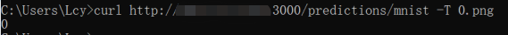


### 优点与补充
&emsp;&emsp;Pythonic 风格和生态系统：PyTorch 的设计理念与 Pythonic 风格一致，使得代码编写更加简洁和可读。同时，PyTorch 拥有庞大的社区和丰富的生态系统，提供了许多预训练模型、工具库和扩展，可以大大加速开发和实验的进程  
&emsp;&emsp;PyTorch 提供了详细而全面的官方文档，涵盖了从入门教程到高级主题的各个方面。这些文档提供了清晰的解释、示例代码和实用的指南，帮助用户快速上手和深入理解 PyTorch 的功能和用法  
&emsp;&emsp;PyTorch 社区共享了许多开源的深度学习模型和预训练模型。用户可以在 PyTorch Hub（[https://PyTorch.org/hub](https://PyTorch.org/hub)）上找到各种模型，包括图像分类、目标检测、语义分割等任务的常用模型。这些模型提供了预训练的权重和示例代码，使用户能够快速应用和调整这些模型  
&emsp;&emsp;PyTorch使用动态图，可以像编写标准的 Python 代码一样构建和调试模型。你可以使用 Python 的控制流语句（如循环和条件语句）来定义模型的结构，这使得模型的构建和调试更直观和灵活。此外，你可以在模型构建过程中进行实时调试和可视化，更好地理解模型的行为。动态图允许在运行时根据不同的条件动态地修改图结构，例如根据输入的变化调整模型的分支、重复模块等。这种动态性和可变性使得 PyTorch 可以处理各种复杂的模型结构，适用于自适应和可变输入的任务。但是动态图无法像静态图那样在编译过程中优化，相对于静态图来说，性能要低一些  
&emsp;&emsp;总的来说，PyTorch 是一个通用且强大的深度学习框架，适用于计算机视觉、自然语言处理、生成模型、强化学习以及研究和教育等领域。  

### 流程图展示
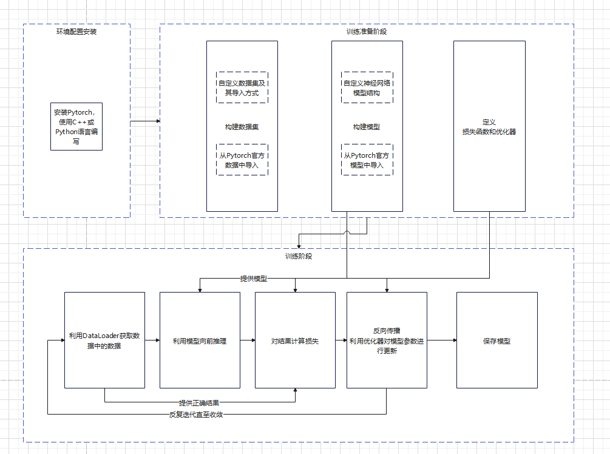  
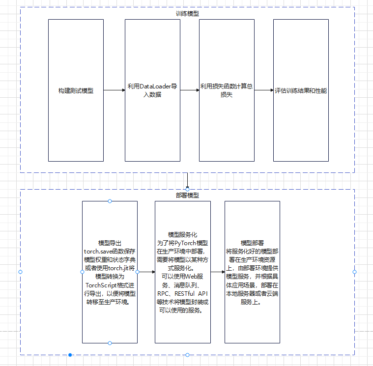  

## 飞桨训练和服务化过程

### 安装部署
飞桨支持多种安装方式，包括基于 Python 的 pip 安装、基于 Docker 的安装、源码编译等。与PyTorch不同的是，飞桨并不支持出Python以外的语言  
可以通过[官方网站](https://www.paddlepaddle.org.cn)提供的安装指南，选择适合你的操作系统和环境的安装方式。  
此外，飞桨的官方网站中已经提供了对于不同操作系统，不同包管理器下的各种[下载方式](https://www.paddlepaddle.org.cn/install)  
如果你对计算机系统是否支持的概念模糊或对Pip包管理器的操作不熟悉的话，飞桨也提供了[快速安装脚本](https://fast-install.bj.bcebos.com/fast_install.sh)用于Linux和MacOS系统  
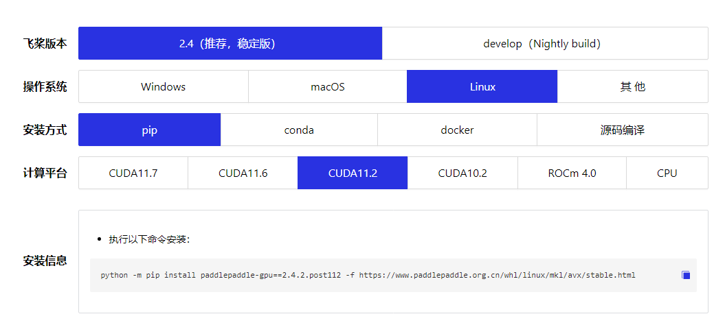  
&emsp;&emsp;第一栏（飞桨版本）：稳定版和develop开发版，稳定版具有更好的稳定性，而开发版会加入更加新的功能，建议安装稳定版本  
&emsp;&emsp;第二栏（操作系统）：支持Linux，Mac和Windows和一些非主流的操作系统（麒麟OS、兆芯、普华OS、龙芯、昆仑），择需选择，但不推荐使用非主流操作系统，支持性官方不能保障  
&emsp;&emsp;第三栏（下载容器或管理器）：Docker是一个开源的应用容器引擎，让开发者可以打包他们的应用以及依赖包到一个可移植的镜像中，里面的环境与外界独立，完全使用沙箱机制，相互之间不会有任何接口。Conda是Python包管理系统，用于安装多个版本的软件包及其依赖关系，并且可以随时切换，各种版本相互隔离，而Pip是Python自带的软件包管理系统，对于系统环境中的Python，在使用Pip时容易和之前安装的软件包发生版本冲突，建议使用Conda安装或者使用docker进行环境隔离  
&emsp;&emsp;第四栏（使用硬件）：CUDA是NVIDIA推出的通用并行计算架构，该架构使GPU能够解决复杂的计算问题，而ROCm是AMD推出的运算平台，硬件适配的情况下，在Linux中，两种模式都将支持，而Windows只支持NVIDIA显卡的CUDA运算模式，在没有NVIDIA和AMD显卡的情况下，选择CPU版本进行安装，在有上述两种显卡的情况下建议安装对应的GPU版本，GPU在处理大规模并行运算中，性能通常比CPU高出10倍到50倍不等，具体情况看计算机硬件中的CPU，GPU核数，频率，型号等等  
### 数据准备与预处理
与Pytorch不同的是飞桨使用paddle.io.Dataset来作为接口，通过继承paddle.io.Dataset并实现__getitem__和__len__接口来定义数据集的读取方式，而飞桨中通过paddle.io.DataLoader来迭代读取数据  
在数据预处理方面，飞桨使用paddle.vision.transform来预处理图像，通过paddle.audio.transform来处理音频数据  

---
对于图像数据，飞桨提供了[各种函数和工具](https://www.paddlepaddle.org.cn/documentation/docs/zh/api/paddle/vision/Overview_cn.html)，如paddle.vision.transforms模块用于图像数据的常见预处理操作，可以进行标准化、归一化、裁剪、缩放、转换格式  
1. 加载图像数据
>使用飞桨的paddle.dataset.image模块可以加载图像数据
```python
import paddle.dataset as dataset
import paddle.vision.transforms as transforms

image_path = "path_to_image.jpg"
image = dataset.image.load_image(image_path)
```
2. 预处理

|操作|方法|作用|
|---|---|---|
|缩放|paddle.vision.transforms.resize|将图像大小调整为指定尺寸|
|裁剪|paddle.vision.transforms.crop|对图像进行裁剪|
|标准化|paddle.vision.transforms.normalize|对图像数据进行标准化处理|
|随机变换|paddle.vision.transforms.RandomRotation|进行随机变换来增加数据多样性|
|饱和度|paddle.vision.transforms.SaturationTransform|调整图像的色彩饱和度|

3. 转换为张量
>飞桨中的模型通常要求输入为张量类型。可以使用paddle.to_tensor函数将图像数据转换为张量  
```python
tensor = paddle.to_tensor(normalized_image)
```
---
对于音频数据，飞桨提供了[各种函数和工具](https://www.paddlepaddle.org.cn/documentation/docs/zh/api/paddle/audio/Overview_cn.html)，如paddle.audio模块用于常见的预处理操作  
1. 加载音频数据
>使用飞桨的paddle.audio.load函数可以加载音频文件
```python
import paddle
audio_path = "path_to_audio_file.wav"
audio, sr = paddle.audio.load(audio_path)
```
2. 波形转换
>音频通常以波形形式表示。你可以使用paddle.audio.to_tensor函数将音频波形转换为张量形式，以便后续处理
```python
audio_tensor = paddle.audio.to_tensor(audio)
```
3. 重采样
>如果音频采样率不适合你的模型或任务需求，你可以使用paddle.audio.resample函数进行重采样
```python
target_sample_rate = 16000  # 目标采样率
resampled_audio = paddle.audio.resample(audio, sr, target_sample_rate)
```
4. 预处理
>预处理包括常见的音频增强和特征提取方法。飞桨提供了各种预处理函数，如添加噪声、剪切、平移、缩放等  

|操作|方法|作用|
|---|---|---|
|缩放|paddle.audio.scale|小于1的缩放因子将降低音频的音量，而大于1的缩放因子将增加音频的音量|
|剪切|paddle.audio.clip|根据指定的时间范围，截取音频波形中的一部分|
|平移|paddle.audio.shift|正数表示向右移动（延迟），负数表示向左移动（提前）|
|添加噪声|paddle.audio.add_noise|添加噪声操作是在原始音频波形中添加额外的噪声信号，以模拟真实环境中的噪声情况|
---
对于文本数据，飞桨提供了[各种函数和工具](https://www.paddlepaddle.org.cn/documentation/docs/zh/api/paddle/text/Overview_cn.html)  
1. 分词
>分词是将文本拆分为单词或子词的过程，常用于文本处理和自然语言处理任务。飞桨提供了多种分词工具和库，如PaddleNLP中的paddlenlp.data模块和第三方库jieba等。以下是使用jieba分词的示例代码  
```python
import jieba
text = "飞桨是一个开源深度学习平台。"
seg_list = jieba.lcut(text)
```
2. 清理和标准化
>清理和标准化操作用于去除文本中的噪声、特殊字符和标点符号，并将文本转换为统一的格式。可以使用正则表达式、字符串处理函数或飞桨的文本处理函数来执行这些操作。以下是一个示例
```python
import re
text = "飞桨，是一个@开源深度学习平台。"
cleaned_text = re.sub(r'[^\w\s]', '', text)
```
3. 构建词汇表
>构建词汇表是将文本数据中的词汇收集起来，并为每个词汇分配唯一的标识符。飞桨的paddle.text.Vocab类可以用于构建词汇表。以下是一个示例
```python
from paddle.text import Vocab
texts = ["飞桨是一个开源深度学习平台。", "PaddlePaddle is an open-source deep learning platform."]
vocab = Vocab.build_from_iterator(texts, unk_token='<unk>', pad_token='<pad>')
```
4. 文本向量化
>将文本转换为数值表示的过程称为文本向量化。常用的方法包括one-hot编码、词嵌入和文本特征提取等。飞桨提供了多种文本向量化的函数和工具，如paddle.text.data模块中的方法和预训练的词向量模型。以下是一个示例
```python
from paddle.text.data import build_vocab_from_iterator, Vocab
from paddle.nn import Embedding
texts = ["飞桨是一个开源深度学习平台。", "PaddlePaddle is an open-source deep learning platform."]
vocab = build_vocab_from_iterator(texts)
embedding = Embedding(len(vocab), embedding_dim)
```
5. 将文本转换为张量
>接下来，可以使用词汇表将预处理后的文本转换为张量。可以使用paddle.text.DataLoader类中的convert_tokens_to_ids函数来实现
```python
ids = vocab.convert_tokens_to_ids(lower_tokens)
tensor = paddle.to_tensor(ids)
```
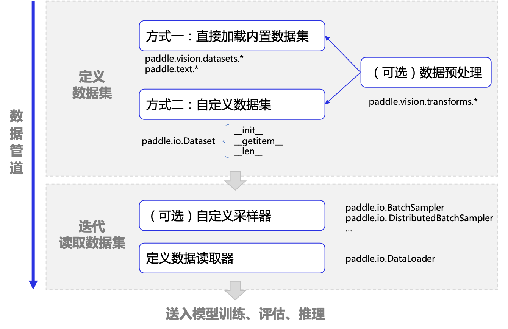  
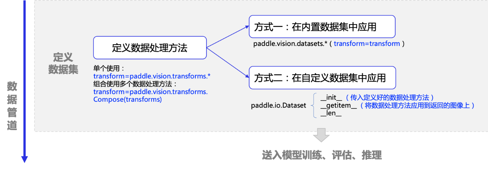  

### 模型构建与训练
&emsp;&emsp;组网方面，飞桨对模型网络结构的构建与PyTorch基本一致，函数名称与类结构和PyTorch一致，自定义神经网络继承的类为paddle.nn.Layer，需要实现forward函数作为前向传播的函数，__init__来进行组网  
&emsp;&emsp;飞桨框架 paddle.nn 下的 API 构建网络，该目录下定义了丰富的神经网络层和相关函数 API，如卷积网络相关的 Conv1D、Conv2D、Conv3D，循环神经网络相关的 RNN、LSTM、GRU 等，方便组网调用，详细清单可在[API 文档](https://www.paddlepaddle.org.cn/documentation/docs/zh/api/paddle/nn/Overview_cn.html)中查看  
构建一些比较复杂的网络结构时，可以选择该方式，组网包括三个步骤：
1. 创建一个继承自 paddle.nn.Layer 的类
2. 在类的构造函数 __init__ 中定义组网用到的神经网络层（layer）
3. 在类的前向计算函数 forward 中使用定义好的 layer 执行前向计算  
下列为模型网络结构构建的示例代码
```python
# 使用 Subclass 方式构建 LeNet 模型
class LeNet(nn.Layer):
    def __init__(self, num_classes=10):
        super(LeNet, self).__init__()
        self.num_classes = num_classes
        # 构建 features 子网，用于对输入图像进行特征提取
        self.features = nn.Sequential(
            nn.Conv2D(
                1, 6, 3, stride=1, padding=1),
            nn.ReLU(),
            nn.MaxPool2D(2, 2),
            nn.Conv2D(
                6, 16, 5, stride=1, padding=0),
            nn.ReLU(),
            nn.MaxPool2D(2, 2))
        # 构建 linear 子网，用于分类
        if num_classes > 0:
            self.linear = nn.Sequential(
                nn.Linear(400, 120),
                nn.Linear(120, 84), 
                nn.Linear(84, num_classes)
            )
    # 执行前向计算
    def forward(self, inputs):
        x = self.features(inputs)

        if self.num_classes > 0:
            x = paddle.flatten(x, 1)
            x = self.linear(x)
        return x
lenet_SubClass = LeNet()

# 可视化模型组网结构和参数
params_info = paddle.summary(lenet_SubClass,(1, 1, 28, 28))
print(params_info)

```

在训练中，飞桨使用prepare设置损失函数和优化器，通过fit来设置训练集迭代次数并进行训练  
对比PyTorch，飞桨训练过程的可视化做的更好，并且训练模型这一步骤封装了函数使训练过程更为简洁，在训练中可以动态的看到在训练过程中对于其中中数据的loss指标，还有acc准确率  
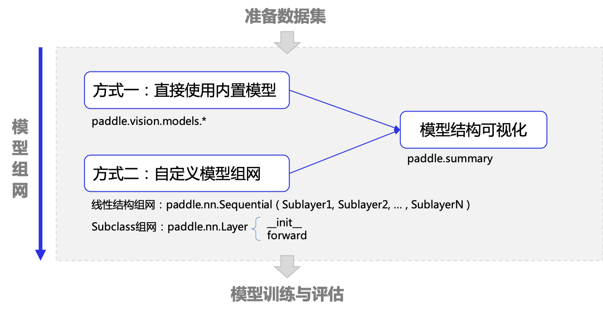  
飞桨模型训练过程可视化  
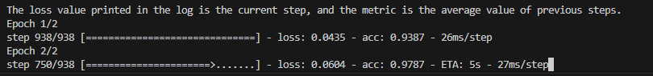  
飞桨模型配置与训练  
```python
# 封装模型
model = paddle.Model(LeNet())
# 选择模型内部优化器
optim = paddle.optimizer.Adam(learning_rate = 0.001, parameters = model.parameters)

# 配置模型
model.prepare(
    optim,
    paddle.nn.CrossEntropyLoss(),
    Accuracy()
)

# 训练模型
model.fit(
    train_dataset,
    epochs = 2,
    batch_size = 64,
    verbose = 1
)
```

### 模型评估
飞桨框架通过基础 API 对训练好的模型进行评估，对应高层 API 的 Model.evaluate 。与模型训练相比，模型评估的流程有如下几点不同之处  
1. 加载的数据从训练数据集改为测试数据集  
2. 模型实例从 train 模式改为 eval 模式
3. 不需要反向传播、优化器参数更新和优化器梯度清零  

```python
# 加载测试数据集
test_loader = paddle.io.DataLoader(test_dataset, batch_size=64, drop_last=True)
# 设置损失函数
loss_fn = paddle.nn.CrossEntropyLoss()
# 将该模型及其所有子层设置为预测模式。这只会影响某些模块，如Dropout和BatchNorm
mnist.eval()
# 禁用动态图梯度计算
for batch_id, data in enumerate(test_loader()):
    
    x_data = data[0]            # 测试数据
    y_data = data[1]            # 测试数据标签
    predicts = mnist(x_data)    # 预测结果
    
    # 计算损失与精度
    loss = loss_fn(predicts, y_data)
    acc = paddle.metric.accuracy(predicts, y_data)
    
    # 打印信息
    if (batch_id+1) % 30 == 0:
        print("batch_id: {}, loss is: {}, acc is: {}".format(batch_id+1, loss.numpy(), acc.numpy()))

```

### 模型部署
paddle.save：使用 paddle.save保存模型，实际是通过 Python pickle 模块来实现的，传入要保存的数据对象后，会在指定路径下生成一个 pickle 格式的磁盘文件  
paddle.load：加载时还需要之前的模型组网代码，并使用paddle.load传入保存的文件路径，即可重新将之前保存的数据从磁盘文件中载入  
另外，paddle.save还支持直接保存 Tensor 数据，或者含 Tensor 的 list/dict 嵌套结构。所以动态图模式下，可支持保存和加载的内容包括：
1. 网络层参数： Layer.state_dict()
2. 优化器参数： Optimizer.state_dict()
3. Tensor 数据 ：（如创建的 Tensor 数据、网络层的 weight 数据等）
4. 含 Tensor 的 list/dict 嵌套结构对象 （如保存 state_dict() 的嵌套结构对象：obj = {'model': layer.state_dict(), 'opt': adam.state_dict(), 'epoch': 100}）

结合以下简单示例，介绍参数保存和载入的方法
```python
# 保存Layer参数
paddle.save(layer.state_dict(), "linear_net.pdparams")
# 保存优化器参数
paddle.save(adam.state_dict(), "adam.pdopt")
# 保存检查点checkpoint信息
paddle.save(final_checkpoint, "final_checkpoint.pkl")

# 载入模型参数、优化器参数和最后一个epoch保存的检查点
layer_state_dict = paddle.load("linear_net.pdparams")
opt_state_dict = paddle.load("adam.pdopt")
final_checkpoint_dict = paddle.load("final_checkpoint.pkl")

# 将load后的参数与模型关联起来
layer.set_state_dict(layer_state_dict)
adam.set_state_dict(opt_state_dict)

# 打印出来之前保存的 checkpoint 信息
print("Loaded Final Checkpoint. Epoch : {}, Loss : {}".format(final_checkpoint_dict["epoch"], final_checkpoint_dict["loss"].numpy()))
```

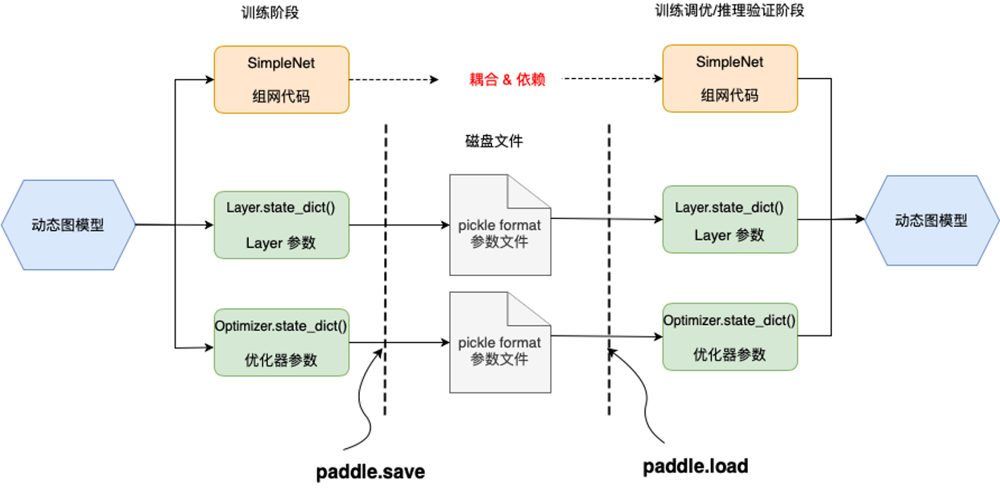

### 服务化
飞桨推理产品 paddle inference 和主框架的 Model.predict 均可实现推理预测，Paddle Inference 是飞桨的原生推理库， 作用于服务器端和云端，提供高性能的推理能力，主框架的 Model 对象是一个具备训练、测试、推理的神经网络。  
相比于 Model.predict，inference 可使用 MKLDNN、CUDNN、TensorRT 进行预测加速，同时支持用 X2Paddle 工具从第三方框架（TensorFlow、Pytorh 、 Caffe 等）产出的模型，可联动 PaddleSlim，支持加载量化、裁剪和蒸馏后的模型部署。  
Model.predict 适用于训练好的模型直接进行预测，paddle inference 适用于对推理性能、通用性有要求的用户，针对不同平台不同的应用场景进行了深度的适配优化，保证模型在服务器端即训即用，快速部署。  
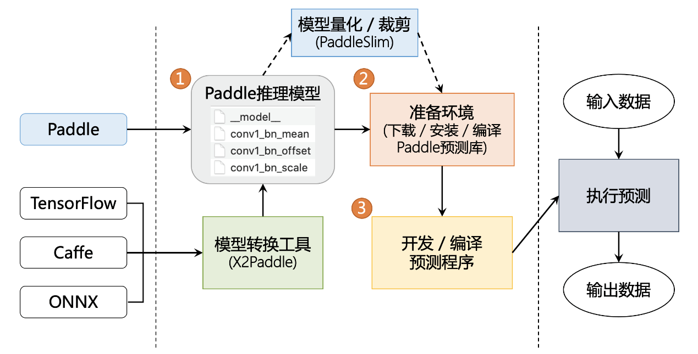

### 优点与补充
飞桨支持动态图与静态图两种模式，开发者既可以使用动态图，这样代码执行是逐行进行的，可以实时查看变量的值和执行过程，方便调试和快速迭代。也可以使用静态图，需要先定义整个计算图的结构，然后才能执行计算。通过将计算图与数据分离，可以进行更高效的计算和优化。静态图模式通常适用于大规模的训练和推理任务，具有更高的性能和计算效率  
飞桨提供了丰富的工具和组件，以支持深度学习开发和部署的全流程。其中包括数据处理工具、模型调优工具、模型压缩工具、模型部署工具等。这些工具与飞桨的核心库紧密集成，提供了便捷的开发环境和功能  

## TensorFlow训练与服务化过程

### 安装部署

以下为TensorFlow所支持的环境
1. Python版本
> 3.6-3.9
2. 系统位
> 64位系统
3. 操作系统版本
>Ubuntu 16.04 或更高版本  
>Windows 7 或更高版本（含 C++ 可再发行软件包）  
>macOS 10.12.6 (Sierra) 或更高版本（不支持 GPU）  

```sh
# 使用pip安装
pip install --user --upgrade tensorflow
```
使用Docker安装  
Docker映像版本按照以下格式进行标记：  
|标记|说明|
|---|---|
|latest| TensorFlow CPU 二进制映像的最新版本。（默认版本）|
|nightly| TensorFlow 映像的每夜版。（不稳定）|
|version|指定 TensorFlow 二进制映像的版本，例如：2.1.0|
|devel| TensorFlow master 开发环境的每夜版。包含 TensorFlow 源代码。|
|custom-op| 用于开发 TF 自定义操作的特殊实验性映像，[详见](https://github.com/tensorflow/custom-op)|

每个基本标记都有会添加或更改功能的变体：
|标记变体|说明|
|---|---|
|tag-gpu|支持 GPU 的指定标记版本|
|tag-jupyter|针对 Jupyter 的指定标记版本|

例如：下载GPU支持和Jupyter的最新稳定发布版
```sh
docker pull tensorflow/tensorflow:latest-gpu-jupyter
```

### 数据准备与预处理

数据加载
```python
# 确保你已经安装了TensorFlow库，并导入所需的库
import tensorflow as tf
import os

# 获取图像文件和标签文件的路径
image_folder = "./img"  # 图像文件夹路径
label_file = "./labels.txt"  # 标签文件路径

# 读取标签文件中的标签信息
with open(label_file, "r") as f:
    labels = f.read().splitlines()

# 创建图像文件路径和对应标签的列表
image_paths = []
for filename in os.listdir(image_folder):
    if filename.endswith(".jpg"):  # 假设图像文件格式为jpg
        image_paths.append(os.path.join(image_folder, filename))

# 创建数据集对象
dataset = tf.data.Dataset.from_tensor_slices((image_paths, labels)) # 使用from_tensor_slices()方法，将图像文件路径和标签作为元组传递给数据集对象。

# 定义图像加载函数
def load_image(image_path, label):
    # 读取图像文件
    image = tf.io.read_file(image_path)
    # 解码图像文件为张量
    image = tf.image.decode_jpeg(image, channels=3)  # 假设图像为RGB格式
    # 进行图像预处理操作，例如归一化、调整大小等
    # ...
    return image, label

# 应用图像加载函数和其他转换操作
dataset = dataset.map(load_image)

# 打乱数据集并设置批次大小
batch_size = 32
dataset = dataset.shuffle(len(image_paths)).batch(batch_size)
```

## 差别
1. 计算图模型  
PyTorch：采用动态计算图模型，允许用户在运行时动态定义和修改计算图，具有灵活性和直观性  
飞桨：支持静态计算图和动态计算图两种模型，静态计算图在编译阶段优化执行效率，动态计算图更灵活  
2. 简洁性和易用性  
PyTorch：以简洁、Pythonic 的 API 设计为特点，易于上手和调试。适合于快速原型开发和实验  
飞桨：提供了高级API和自动化工具，如飞桨动态图、飞桨静态图和飞桨高层API，能够简化开发流程和减少样板代码  
3. 功能和扩展性  
PyTorch：具有丰富的模型构建、训练和调优工具，支持各种深度学习任务和领域。具备良好的社区支持和活跃的生态系统  
飞桨：提供了丰富的模型库和算法、分布式训练、模型压缩、模型融合等功能，适合大规模的深度学习应用  
4. 部署和推理  
PyTorch：在模型部署和推理方面相对较为灵活，可以通过ONNX和TorchScript等工具进行模型转换和优化  
飞桨：提供了TorchServe等高性能模型服务框架，能够方便地部署和管理模型，支持多种部署场景  
5. 社区与资源  
PyTorch：拥有庞大的开发者社区和丰富的资源，有大量的开源项目、教程和预训练模型可供使用  
飞桨：百度背景下，飞桨在国内拥有广泛的影响力和资源支持，适合与百度生态系统的其他技术和服务集成  

# 应用实例
使用PyTorch对图像进行识别，现搭建于公网  
[http:\\\\124.221.123.251:8501](http:\\124.221.123.251:8501)  
上传图像到Upload an image栏中即可运行  
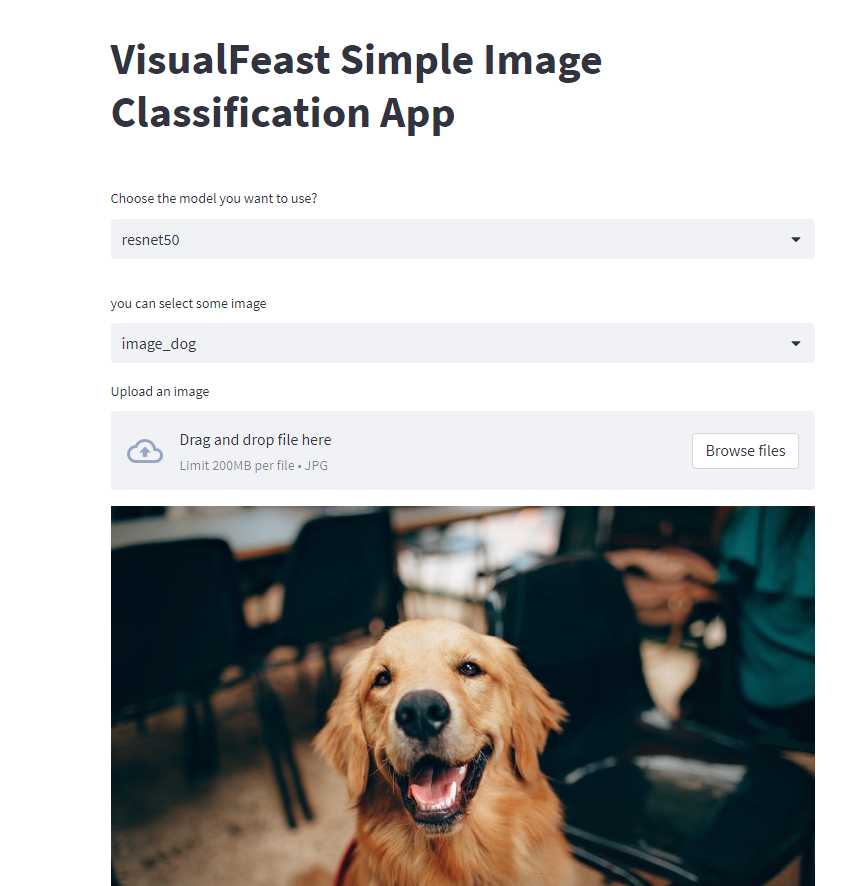  
分析性能和准确度良好  
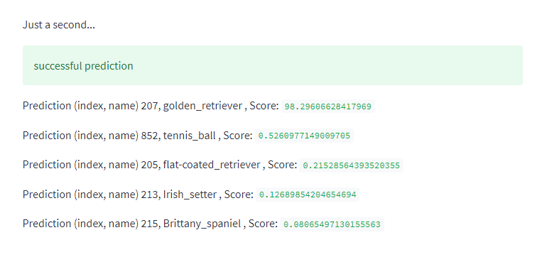   
与金毛犬匹配相似度高达98%，与其他实物相似度不超过1%(选取匹配相似度中前五名)  

# 调研总结
1. 深度学习框架未来发展趋势  
未来的深度学习框架将更加注重简化和自动化。这包括自动化的模型设计和调优，自动化的超参数选择，以及更高级的API和工具，使得开发者能够更轻松地构建和训练深度学习模型，降低开发门槛  
随着深度学习应用的不断增多，对模型的可解释性和可信性要求也越来越高。未来的框架将更加关注模型的可解释性，提供更好的可视化和解释工具，帮助用户理解和解释模型的决策过程  
2. 深度学习框架为AI产业化奠定基础  
智能语音助手是目前广泛应用于智能设备和互联网服务的AI技术之一。例如，Apple的Siri、Amazon的Alexa和Google的Assistant等智能语音助手在我们的日常生活中发挥着重要的作用  
深度学习框架在智能语音助手的开发中起着关键的作用，通过高级的抽象接口和自动化工具，开发者可以快速构建并迭代模型，极大地缩短了模型开发周期。此外，深度学习框架提供了丰富的算法和模型库，使得开发者可以直接使用和调整已有的模型，减少了从零开始构建模型的工作量  
1. 深度学习框架已为AI企业中智能开发的得力支柱  
对于人工智能的发展趋势，不同领域的实践者有不同的看法。人工智能技术本身的认知能力会在一定程度上影响对人工智能价值的判断。从技术发展的角度看，人工智能的价值更多地体现在“技术创新”上，而技术创新往往是推动产业发展的核心动力。目前，基于人工智能的创新不断涌现，一些创新技术（视觉、自然语言处理等）也得到应用，开辟了新的价值空间  
一些早期证据表明，人工智能具有良好的商业前景，愿意在运营阶段和核心职能部门部署人工智能的企业可以获得实际收益。我们在调查中发现，一些龙头企业将强大的数字化能力与积极主动的战略结合起来，以实现更高的利润率，其业绩优势有望在未来三年进一步增强  